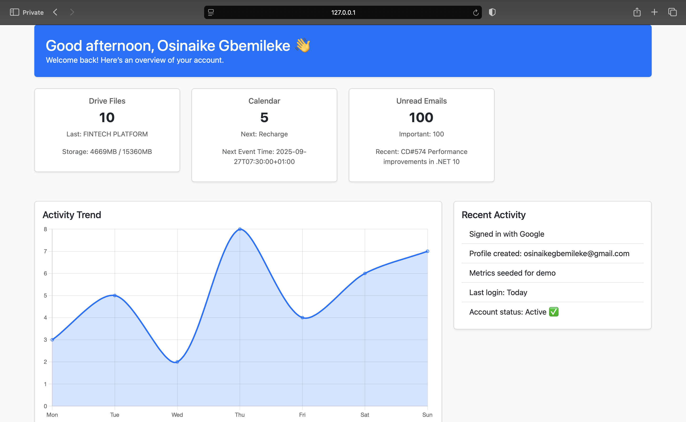

Google Integrated Dashboard (FastAPI + OAuth2)

This is a demo dashboard built with FastAPI, Authlib, and Bootstrap that integrates with Google APIs.
After signing in with your Google account, it displays a unified dashboard with metrics from Google Drive, Gmail, and Google Calendar.

✨ Features

Google OAuth2 login (via Authlib).

Google Drive: total files, most recent file name.

Google Calendar: number of upcoming events, next event + start time.

Gmail: unread email count, most recent subject.

Dynamic dashboard with cards + charts (Bootstrap 5 + Chart.js).

⚙️ Setup
1. Clone project
git clone https://github.com/Osigbemes/Fastapi-Oauth-Jinja-Dashboard.git
cd Fastapi-Oauth-Jinja-Dashboard

2. Create and activate virtual environment
python -m venv venv
source venv/bin/activate  # Linux / macOS
venv\Scripts\activate     # Windows

3. Install dependencies
pip install -r requirements.txt

4. Google Cloud setup

Go to Google Cloud Console
.

Create a new project.

Enable these APIs:

Google Drive API

Google Calendar API

Gmail API

People API (for user profile info)

Create OAuth 2.0 Client ID credentials.

Application type: Web application

Add http://localhost:8000/auth/callback as redirect URI.

Download the JSON client secret.

5. Environment variables (.env)
SECRET_KEY=your_random_secret_key
GOOGLE_CLIENT_ID=your_google_client_id
GOOGLE_CLIENT_SECRET=your_google_client_secret
DATABASE_URL=your_database
BASE_URL=http://localhost:8000
GOOGLE_REDIRECT_URI=http://127.0.0.1:8000/auth/google/callback

🚀 Run the project
1. Start FastAPI
uvicorn main:app --reload

2. Visit

Open: http://localhost:8000

Click Login with Google

On successful login, you’ll see your Dashboard

📊 Dashboard Data
Card	Data Shown
Drive Files	Total file count, most recent uploaded file
Calendar	Upcoming events count, next event title + time
Gmail	Unread email count, most recent subject line
Activity Trend	Chart.js demo graph (logins, activity)

📌 Notes

Built as a demo app for showcasing Google API integrations.

Extendable to show Google Docs, Sheets, Contacts, etc..

Works with FastAPI sessions to persist login state.

📷 Preview

Dashboard after login:

Welcome banner

Drive stats

Calendar next event

Gmail unread messages

Activity trend chart

💡 This project demonstrates API integration skills, OAuth2 implementation, and data visualization — ideal to showcase in an interview.

Code Sample:

